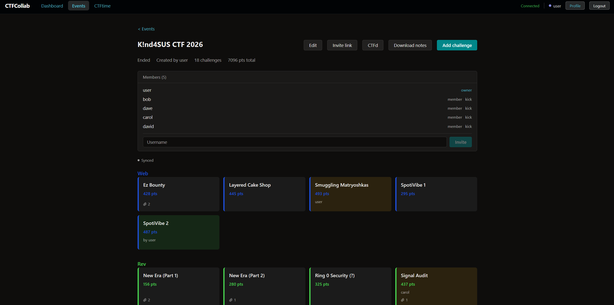

# CTFCollab

CTFCollab is an offline-first collaboration platform for Capture-the-Flag (CTF) teams. It is built for competitions and environments where network access is unreliable or sometimes non-existent at all, such as on-site finals, travel, or venues with overloaded wifi. To make this possible, CTFCollab keeps a local copy of all events, challenges, and notes a user has access to in their browser, so the app stays usable while offline. Changes made while offline sync back to the server once the connection is restored.



<h3 align="center">Live demo: <a href="https://ctfcollab.ee">ctfcollab.ee</a></h3>

## Features

- Offline-first local copy of all accessible events, challenges, and notes. The app opens and remains usable without a network connection.
- Real-time collaborative notes. Multiple users can edit the same note simultaneously with live cursors and presence indicators.
- Challenge tracking with points, categories, flags, solver assignment, and file attachments.
- Markdown export for individual notes or a full event as a zip archive.
- Per-event invite links that create restricted accounts scoped to a single event, useful for one-off guests.
- CTFd API integration to allow automatically pulling challenges and team placement.

## Running it

Copy `.env.example` to `.env` and set a Postgres password. Then run:

```shell
docker compose up -d
```

This pulls the prebuilt images and starts everything. The frontend is reachable on port 80.

To build the images from source instead:

```shell
docker compose -f docker-compose.dev.yml up
```

If you only want the database in Docker and want to run the backend/frontend yourself:

```shell
docker compose up -d db
cd backend && cargo run
cd frontend && npm install && npm run dev
```

The backend reads `DATABASE_URL` from the environment. For local dev, point it at the Postgres credentials set in `.env`:

```
postgres://<POSTGRES_USER>:<POSTGRES_PASSWORD>@localhost:5432/<POSTGRES_DB>
```

## HTTPS

The frontend container serves plain HTTP on port 80. For any deployment reachable over a network, put it behind TLS so logins and JWTs are not sent in the clear. The recommended way is to get a certificate with [certbot](https://certbot.eff.org/) and terminate TLS in front of CTFCollab with a reverse proxy (such as nginx or Caddy on the host) that forwards to port 80.
